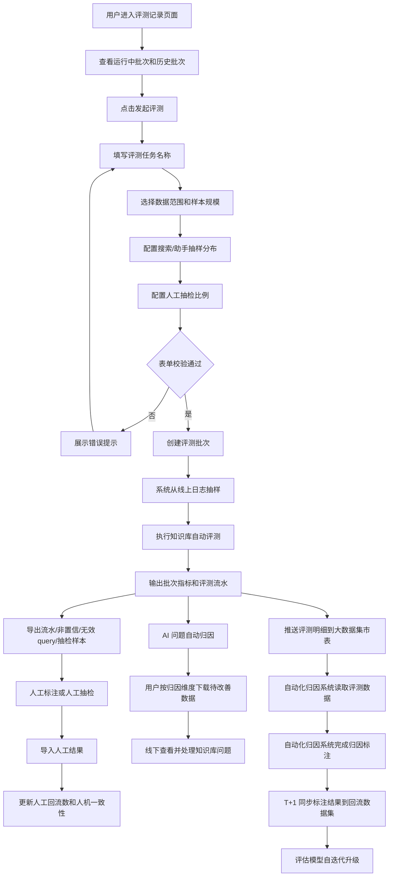

# 知识库自动化评测V1.1 PRD

## 文档修订记录

| 版本 | 内容 | 作者 | 日期 |
| --- | --- | --- | --- |
| V1.1 | 新增知识库效果自动化评测、发起评测、批次管理、AI 问题归因、归因数据下载、人工抽检、人机一致性、流水导出、自动化归因系统联动能力 | 待补充 | 2026/07/15 |

产品需求评审（PRD）：`Review Pending`

## 1. 概述

### 1.1. 需求背景、目标及收益

**需求背景：** 当前知识库问答效果主要依赖人工抽检和事后 badcase 分析，存在覆盖率低、定位慢、问题归因口径不统一的问题。需要建设自动化评测能力，对线上 Query 批量评测，并通过人工抽检和归因数据下载形成问题定位闭环。

**产品目标：**

1. 支持运营、算法、知识库负责人周期性发起知识库效果自动化评测。
2. 支持按数据范围、样本规模、Query 来源分布、人工抽检比例创建评测批次。
3. 支持输出总样本、有效样本、最终得分、低置信度样本、无效 query、人机一致性等指标。
4. 支持 AI 自动归因，并允许用户按归因维度下载待改善数据进行线下查看和处理。
5. 支持导出评测流水、非置信样本、无效 query、人工抽检样本，并支持人工结果导入回流。

**预期收益：**

1. 提升知识库效果评测覆盖率，减少纯人工抽检成本。
2. 提升问题定位效率，使知识库问题能按维度定位到问题理解、证据召回、答案生成、边界策略等方向。
3. 通过人机一致性指标持续校准 AI 评测可信度。
4. 形成「自动评测 - AI 归因 - 数据下载 - 人工抽检 - 结果回流 - 知识库优化」闭环。

**需求来源/关联资料：**

- 原型页面：`file:///Users/xielizheng.3/Downloads/judge_agent_mvp/master%E5%88%86%E6%B5%81%E8%87%AA%E5%8A%A8%E5%8C%96%E8%AF%84%E6%B5%8B/index.html`
- 本地文件：`/Users/xielizheng.3/Downloads/judge_agent_mvp/master分流自动化评测/index.html`

### 1.2. 竞品分析（选填）

| 竞品/方案 | 相关能力 | 优势 | 劣势 | 对本需求的启示 |
| --- | --- | --- | --- | --- |
| 人工抽检 | 人工判断问答质量 | 准确性高，可解释性强 | 成本高、覆盖低、周期长 | 本需求保留人工抽检作为校准环节，不作为主评测方式 |
| 自动化脚本评测 | 批量打分 | 覆盖高、效率高 | 缺少业务归因和数据查看闭环 | 本需求需补充 AI 归因、归因数据下载和回流能力 |
| Badcase 复盘 | 问题案例分析 | 能沉淀典型问题 | 只能事后分析，难以量化趋势 | 本需求需支持批次级指标和可导出明细 |

### 1.3. 用户分析

| 用户名称 | 使用频率 | 用户描述 | 核心关注点 |
| --- | --- | --- | --- |
| 知识库运营 | 每周/每批次 | 负责知识库内容维护、问题定位和优化跟进 | 哪些知识库问题最多、哪些 Query 需要修、如何导出处理 |
| 算法/评测负责人 | 每周/按版本 | 负责自动评测策略、打分准确性和评测稳定性 | 指标定义、人机一致性、置信样本质量 |
| 业务负责人 | 周期查看 | 关注知识库整体服务效果和趋势变化 | 最终得分、有效样本数、低置信度、无效 query 占比 |
| 人工标注人员 | 按任务处理 | 对抽检样本或非置信样本做人工标注 | 导出字段完整、导入回流格式清晰 |

### 1.4. 指标支撑

| 产品目标 | 产品核心指标 | 支撑关系说明 |
| --- | --- | --- |
| 衡量知识库回答效果 | 最终得分 | 最终得分 = 1 分数量 / 评测有效样本数 |
| 排除不可评测样本干扰 | 评测有效样本数 | 有效样本数 = 总样本数 - 低置信度样本数 - 无效 query |
| 衡量 AI 评测可信度 | 人机一致性 | 人机一致性 = AI 得分与人工得分一致样本数 / 已导入抽检样本数 |
| 定位主要问题类型 | AI 问题归因待改善数 | 按归因维度聚合 -1 分和 0 分样本，并支持下载对应数据，辅助定位改进方向 |
| 控制样本结构 | Query 来源分布 | 支持搜索/助手来源样本按比例抽样 |

### 1.5. 名词解释

| 序号 | 名词 | 解释 |
| --- | --- | --- |
| 1 | 评测批次 | 用户一次发起的知识库自动化评测任务 |
| 2 | 评测样本总数 | 本批次纳入评测流程的全部样本数 |
| 3 | 评测有效样本数 | 总样本数扣除低置信度样本和无效 query 后的样本数 |
| 4 | 低置信度样本 | AI 无法稳定判断、需要人工复核的样本 |
| 5 | 无效 query | 闲聊、测试语、意图不清、纯符号等无法进行知识库效果评测的 Query |
| 6 | Query 来源 | Query 产生渠道，本期支持搜索和助手 |
| 7 | 人机一致性 | 人工抽检结果与 AI 自动评测结果一致的比例 |
| 8 | AI 问题归因 | 系统基于评测结果自动判断问题所在维度 |

## 2. 总体流程

### 2.1. 流程设计

### 2.2. 涉及系统

| 涉及产品 | 支持（或依赖）内容 | 产品对接人 | 内容确认状态 |
| --- | --- | --- | --- |
| 线上日志系统 | 提供指定时间范围内搜索/助手 Query、TraceID、用户 Pin、答案等原始数据 | 待补充 | 待确认 |
| 知识库问答系统 | 提供知识库召回、答案生成、命中知识片段等信息 | 待补充 | 待确认 |
| 自动评测服务 | 输出 AI 得分、置信状态、无效 query 判断、问题归因维度分 | 待补充 | 待确认 |
| 人工标注/抽检工具 | 支持人工标注数据导入和抽检结果回流 | 待补充 | 待确认 |
| 文件导出服务 | 支持导出 Excel 兼容文件 | 待补充 | 待确认 |
| 大数据集市 | 承接知识库评测批次、评测流水、AI 得分、归因维度分等标准化明细数据 | 待补充 | 待确认 |
| 自动化归因系统 | 从大数据集市读取评测数据，完成自动化归因标注，并产出可回流数据 | 待补充 | 待确认 |
| 回流数据集 | 承接自动化归因标注后的回流数据，用于评估模型自迭代升级 | 待补充 | 待确认 |

## 3. 功能需求

### 3.1. 功能列表

| 功能模块 | 子功能点 | 调整类型 | 调整内容简要描述 | 优先级 |
| --- | --- | --- | --- | --- |
| 评测批次 | 批次首页 | 新增 | 展示运行中批次、评测批次列表和发起评测入口 | 高 |
| 发起评测 | 创建评测任务 | 新增 | 支持任务名称、数据范围、样本规模、抽样分布、人工抽检比例 | 高 |
| 批次详情 | 指标卡 | 新增 | 展示总样本、有效样本、最终得分、低置信度、无效 query、人机一致性等指标 | 高 |
| AI 归因 | 问题自动归因 | 新增 | 按问题理解、证据相关性、证据充分性等维度聚合待改善问题，维度评分统一使用 -1/0/1，并支持按维度下载数据 | 高 |
| 评测流水 | 流水列表 | 新增 | 展示 Query、Query 来源、问题归因、置信状态和得分 | 高 |
| 归因数据 | 下载归因维度数据 | 新增 | AI 归因列表本期不支持点击下钻，支持按归因维度下载待改善数据 | 高 |
| 数据导出 | 导出所有/非置信/无效 query | 新增 | 支持导出当前批次评测流水数据 | 高 |
| 人工抽检 | 导出/导入抽检样本 | 新增 | 支持抽检样本导出、人工得分导入和一致性计算 | 高 |
| 人工回流 | 导入人工标注 | 新增 | 支持导入人工标注 CSV，更新人工回流条数和批次状态 | 中 |
| 系统联动 | 评测数据推送大数据集市 | 新增 | 将知识库评测明细推送至大数据集市表，供自动化归因系统消费 | 高 |
| 系统联动 | 自动化归因回流数据同步 | 新增 | T+1 自动同步自动化归因标注结果到回流数据集，用于评估模型自迭代升级 | 高 |

### 3.2. 评测批次首页

#### 3.2.1. 批次首页与运行中批次

| 字段 | 内容 |
| --- | --- |
| 用户场景 | 用户进入自动评测记录页面后，需要快速了解当前是否有正在运行的知识库评测任务，并查看历史批次。 |
| 功能简述 | 页面顶部展示「知识库效果自动化评测」标题、运行中批次卡片和评测批次列表。 |
| 输入/前置条件 | 用户具备查看评测记录权限；系统存在批次数据。 |
| 流程说明 | 用户进入页面后，系统默认展示批次首页；若存在运行中批次，则展示运行中批次卡片。 |
| 需求描述 | 见下方字段和规则。 |
| 业务规则 | 运行中批次展示当前进度；历史批次在列表中展示。 |
| 输出/后置条件 | 用户可点击「发起评测」创建新批次，或点击历史批次查看结果。 |
| 补充说明 | 页面只保留一个「发起评测」入口，位于评测批次区域。 |

**运行中批次展示字段**

| 字段 | 说明 |
| --- | --- |
| 运行状态 | 展示「正在运行 · 批次 ID」。 |
| 批次标题 | 展示业务名称和期数，例如「线上问答 · 第14期自动化评测」。 |
| 数据范围 | 展示本批次使用的线上日志时间范围。 |
| 样本规模 | 展示本批次样本数。 |
| 进度条 | 展示已完成样本数占总样本数的比例。 |
| 预计完成时间 | 展示预计剩余耗时。 |
| 环形进度 | 展示评测进度百分比。 |

**批次列表字段**

| 字段 | 说明 |
| --- | --- |
| 批次名称 | 展示批次 ID + 批次名称，例如 `RUN-0714-03 · 第13期自动化评测`。 |
| 数据范围 | 展示本批次评测使用的日志时间范围。 |
| 样本数 | 展示本批次抽样样本规模。 |
| 评测进度 | 展示自动评测完成百分比，运行中批次展示进度条。 |
| 最终得分 | 已完成批次展示百分比分数；运行中批次展示 `—`。 |
| 人工回流条数 | 展示已导入人工标注或抽检回流的数据量。 |
| 状态 | 支持「运行中」「已完成」。 |
| 操作 | 支持「查看结果」。 |

**交互规则**

1. 点击「发起评测」打开「发起知识库评测」弹窗。
2. 点击批次名称进入对应批次详情页。
3. 点击「查看结果」进入对应批次详情页。
4. 运行中批次最终得分展示 `—`。
5. 已完成批次最终得分展示百分比，保留 1 位小数。
6. 批次列表默认按批次时间倒序展示。

### 3.3. 发起知识库评测

#### 3.3.1. 创建评测任务

| 字段 | 内容 |
| --- | --- |
| 用户场景 | 运营、算法、知识库负责人需要周期性创建一次知识库效果自动化评测任务。 |
| 功能简述 | 支持用户配置评测任务名称、评测数据范围、样本规模、Query 来源抽样分布、人工抽检比例。 |
| 输入/前置条件 | 用户具备创建评测任务权限；系统可读取指定时间范围内的线上日志。 |
| 流程说明 | 用户在评测批次区域点击「发起评测」按钮，打开弹窗；填写并确认后，系统创建评测批次并开始运行。 |
| 需求描述 | 见字段说明、交互规则和业务规则。 |
| 业务规则 | 系统按数据范围、样本规模、来源分布和抽检比例生成评测任务。 |
| 输出/后置条件 | 创建成功后新增一条评测批次记录，状态为「运行中」。 |
| 补充说明 | 本期不支持目标系统版本选择，不展示版本配置项。 |

**字段说明**

| 字段 | 是否必填 | 默认值 | 具体说明 |
| --- | --- | --- | --- |
| 评测任务名称 | 是 | 空 | 用户自定义本次评测名称，最多 50 字。 |
| 数据范围 | 是 | 最近一周 | 指定需要评测的线上日志时间范围。 |
| 开始日期 | 是 | 默认起始日期 | 线上日志筛选开始时间。 |
| 结束日期 | 是 | 默认结束日期 | 线上日志筛选结束时间。 |
| 样本规模 | 是 | 1,000 条 | 支持 500 条、1,000 条、2,000 条、全量。 |
| 抽样分布 | 是 | 搜索:助手 = 1:1 | 控制不同 Query 来源在评测样本中的抽样比例。 |
| 搜索 query 占比 | 是 | 1 | 用于计算搜索来源 Query 在样本中的占比。 |
| 助手 query 占比 | 是 | 1 | 用于计算助手来源 Query 在样本中的占比。 |
| 人工抽检数比例 | 是 | 10% | 从置信样本中按比例抽取人工抽检样本，支持 5%、10%、20%、30%。 |

**交互规则**

1. 打开弹窗后，默认选中样本规模 `1,000 条`，人工抽检比例 `10%`，抽样分布 `搜索:助手 = 1:1`。
2. 用户输入评测任务名称时，实时展示字数，例如 `12 / 50`。
3. 评测任务名称为空时，点击「创建并开始评测」后输入框标红，并提示「请输入评测任务名称」。
4. 用户调整搜索/助手占比后，系统实时展示预计抽样比例，例如 `2:3` 对应搜索 40%、助手 60%。
5. 搜索 query 占比和助手 query 占比只能输入非负整数，且不能同时为 0。
6. 开始日期不能晚于结束日期。
7. 点击「取消」、关闭按钮或弹窗遮罩，关闭弹窗且不创建任务。
8. 按 `Esc` 时关闭弹窗且不创建任务。
9. 点击「创建并开始评测」后，系统创建评测批次，状态为「运行中」。

**业务规则**

1. 系统根据用户选择的数据范围，从线上日志中筛选候选 Query。
2. 系统按照样本规模抽取评测样本；若选择全量，则使用符合条件的全部样本。
3. 系统按照 `搜索 query 占比 : 助手 query 占比` 控制样本来源分布。
4. 自动评测完成后，系统对样本输出 AI 得分、问题归因、是否置信、是否无效 query 等结果。
5. 人工抽检样本仅从置信样本中抽取，不包含低置信度样本和无效 query。
6. 人工抽检比例用于计算抽检样本数，并支撑后续人机一致性指标计算。

### 3.4. 批次详情页

#### 3.4.1. 批次详情页头部与筛选

| 字段 | 内容 |
| --- | --- |
| 用户场景 | 用户进入某个批次后，需要查看本批次的整体结果和明细流水。 |
| 功能简述 | 展示批次标题、批次元信息、返回按钮、导入人工标注入口和时间范围筛选。 |
| 输入/前置条件 | 用户从批次列表进入某个评测批次。 |
| 输出/后置条件 | 用户可以查看当前批次指标、归因和流水。 |

**页面头部字段**

| 字段 | 说明 |
| --- | --- |
| 返回按钮 | 点击后返回评测批次列表。 |
| 批次标题 | 展示 `批次 ID · 批次名称`。 |
| 批次元信息 | 展示数据范围、样本数和评测状态。 |
| 导入人工标注 | 上传人工标注 CSV，用于人工回流。 |

**筛选字段**

| 字段 | 说明 |
| --- | --- |
| 时间范围 | 支持近 7 天、近 30 天、近 90 天、自定义。 |
| 自定义日期 | 选择自定义时展示开始日期和结束日期。 |
| 数据更新时间 | 展示页面数据刷新时间。 |

**交互规则**

1. 点击返回按钮，隐藏详情页，回到批次列表。
2. 点击「导入人工标注」，打开文件选择器。
3. 选择近 7 天、近 30 天、近 90 天后，刷新指标、归因和流水。
4. 选择自定义后，展示日期选择器；开始和结束日期都选择后刷新数据。

#### 3.4.2. 指标卡

| 字段 | 内容 |
| --- | --- |
| 用户场景 | 用户需要快速判断本批次知识库问答整体效果。 |
| 功能简述 | 通过指标卡展示总样本、有效样本、最终得分、各类得分数量、低置信度、无效 query、人机一致性。 |
| 输入/前置条件 | 批次已产生自动评测结果。 |
| 输出/后置条件 | 用户可判断本批次质量变化，并定位需要重点处理的问题。 |

**指标定义**

| 指标 | 计算方式 | 展示说明 |
| --- | --- | --- |
| 评测样本总数 | 本批次全部评测样本数 | 展示数量和较上一周期变化。 |
| 评测有效样本数 | 总样本数 - 低置信度样本数 - 无效 query | 展示数量、占总样本比例和较上一周期变化。 |
| 最终得分 | 1 分数量 / 评测有效样本数 | 展示百分比，保留 1 位小数。 |
| -1 分数量 | AI 判定回答错误的样本数 | 展示数量、占总样本比例和较上一周期变化，越低越好。 |
| 0 分数量 | 低置信度样本数 + 无效 query 数 | 展示数量、占总样本比例和较上一周期变化，越低越好。 |
| 1 分数量 | AI 判定回答正确的有效样本数 | 展示数量、占有效样本比例和较上一周期变化，越高越好。 |
| 低置信度样本数 | AI 判定需要人工复核的样本数 | 展示数量、占总样本比例和较上一周期变化。 |
| 无效 query | 闲聊、测试语、意图不清等无效样本数 | 展示数量、占总样本比例和较上一周期变化。 |
| 人机一致性 | AI 得分与人工得分一致样本数 / 已导入抽检样本数 | 展示百分比、抽检占比和抽检数。 |

**交互规则**

1. 人机一致性指标卡内展示「导出抽检」和「导入抽检」按钮。
2. 点击「导出抽检」导出本批次人工抽检样本。
3. 点击「导入抽检」上传人工抽检结果文件。
4. 导入成功后刷新人机一致性指标。

### 3.5. AI 问题自动归因

#### 3.5.1. 归因聚合

| 字段 | 内容 |
| --- | --- |
| 用户场景 | 用户需要知道知识库问答效果差的具体原因，并推动对应责任方处理。 |
| 功能简述 | 系统基于自动评测结果，对知识库问题进行 AI 归因，并按维度聚合展示待改善数量。 |
| 输入/前置条件 | 样本已完成自动评测，系统已生成维度得分和归因结果。 |
| 输出/后置条件 | 用户可按归因维度下载对应待改善样本，用于线下查看和处理。 |

**归因维度**

| 维度 | 英文字段 | 评分含义 |
| --- | --- | --- |
| 问题理解 | query_understanding | 1 分：准确回应用户问题；0 分：部分回应但有轻微偏移；-1 分：答非所问或理解错对象/场景。 |
| 证据相关性 | evidence_relevance | 1 分：召回证据和问题高度相关；0 分：部分相关；-1 分：基本无关。 |
| 证据充分性 | evidence_sufficiency | 1 分：证据足够支撑完整回答；0 分：证据只能支撑部分回答；-1 分：证据不足以回答问题。 |
| 回答忠实度 | groundedness | 1 分：回答完全基于证据；0 分：大体基于证据但有轻微扩展；-1 分：回答包含证据无支撑结论。 |
| 回答完整性 | completeness | 1 分：回答完整，包含条件、限制、步骤或边界；0 分：部分完整；-1 分：明显缺少关键信息。 |
| 边界处理 | boundary_handling | 1 分：证据不足或问题不明确时正确说明边界/追问；0 分：边界说明不充分；-1 分：证据不足仍强行给确定结论。 |

**展示规则**

1. 每个归因维度展示维度名称、英文字段、评分口径、平均分、-1 分数量、0 分数量和待改善数量。
2. 待改善数量 = 该维度 -1 分样本数 + 0 分样本数。
3. 归因维度卡片本期不支持点击、双击、键盘回车等下钻查看详情操作。
4. 每个归因维度右侧展示「下载数据」按钮，用于导出该维度下 -1 分和 0 分的待改善样本。

**下载数据规则**

| 字段 | 说明 |
| --- | --- |
| 下载范围 | 当前批次、当前筛选范围内，该归因维度评分为 -1 或 0 的样本。 |
| 导出格式 | Excel 兼容文件。 |
| 文件名 | `{批次ID}_{归因维度}_待改善数据.xls`。 |
| 导出字段 | 归因维度、维度评分、时间、TraceID、用户 Pin、Query、Query 来源、答案、最终问题归因、是否置信、得分、风险级别、责任方、证据说明。 |

### 3.6. 评测流水

#### 3.6.1. 流水列表

| 字段 | 内容 |
| --- | --- |
| 用户场景 | 用户需要查看每条 Query 的评测结果，并导出样本进行线下分析或人工处理。 |
| 功能简述 | 流水表展示单条 Query 的评测明细，支持分页和导出；本期不支持从流水行下钻查看详情。 |
| 输入/前置条件 | 批次已产生评测流水。 |
| 输出/后置条件 | 用户可查看列表信息或导出评测样本。 |

**流水字段**

| 字段 | 说明 |
| --- | --- |
| 时间 | Query 发生时间。 |
| TraceID | 单条请求链路 ID。 |
| 用户 Pin | 发起 Query 的用户标识。 |
| Query | 用户原始问题。 |
| Query 来源 | 支持搜索、助手。 |
| 问题归因 | AI 自动归因结果。 |
| 是否置信 | 支持置信、非置信需人工复核、无效 query。 |
| 得分 | 置信样本展示 1 / 0 / -1；非置信和无效 query 展示 `—`。 |

**交互规则**

1. 流水表每页展示 20 条样本。
2. 底部展示当前页范围和总流水数，例如 `显示 1-20 / 共 100 条流水`。
3. 评测流水行本期不支持点击、双击、键盘回车等下钻查看详情操作。
4. 无效 query 在「是否置信」列展示为「无效 query」。
5. 非置信样本在「是否置信」列展示为「非置信 · 需人工复核」。
6. 无效 query 和非置信样本不展示得分，得分列展示 `—`。

#### 3.6.2. 数据导出

| 字段 | 内容 |
| --- | --- |
| 用户场景 | 用户需要导出样本用于线下分析、人工标注或问题修复。 |
| 功能简述 | 支持导出所有流水、导出非置信样本、导出无效 query。 |
| 输入/前置条件 | 当前批次存在可导出的评测流水。 |
| 输出/后置条件 | 生成 Excel 兼容文件。 |

**导出按钮**

| 按钮 | 导出范围 |
| --- | --- |
| 导出所有 | 当前批次当前筛选范围内的全部流水。 |
| 导出非置信 | 当前批次当前筛选范围内 `是否置信=非置信 · 需人工复核` 的样本。 |
| 导出无效 query | 当前批次当前筛选范围内的无效 query。 |

**导出字段**

| 字段 | 说明 |
| --- | --- |
| 时间 | Query 发生时间。 |
| TraceID | 请求链路 ID。 |
| 用户 Pin | 用户标识。 |
| Query | 用户原始问题。 |
| Query 来源 | 搜索或助手。 |
| 答案 | 系统回答内容。 |
| 问题归因 | AI 自动归因结果。 |
| 是否置信 | 置信、非置信、无效 query。 |
| 得分 | 置信样本为 1/0/-1；非置信和无效 query 为空。 |

**文件命名规则**

| 导出类型 | 文件名格式 |
| --- | --- |
| 导出所有 | `{批次ID}_全部评测流水.xls` |
| 导出非置信 | `{批次ID}_非置信样本.xls` |
| 导出无效 query | `{批次ID}_无效query.xls` |

### 3.7. AI 归因数据下载

| 字段 | 内容 |
| --- | --- |
| 用户场景 | 用户需要查看某个归因维度下的待改善样本，但本期页面不支持点击卡片下钻查看详情。 |
| 功能简述 | 在每个 AI 归因维度右侧提供「下载数据」按钮，导出该维度评分为 -1 或 0 的待改善样本。 |
| 输入/前置条件 | 当前批次已完成自动评测，且系统已生成维度评分和归因结果。 |
| 输出/后置条件 | 用户获得 Excel 兼容文件，可在线下查看该归因维度对应的样本明细。 |

**导出字段**

| 字段 | 说明 |
| --- | --- |
| 归因维度 | 当前下载按钮对应的问题维度。 |
| 维度评分 | 当前样本在该维度下的评分，取值为 -1 或 0。 |
| 时间 | Query 发生时间。 |
| TraceID | 请求链路 ID。 |
| 用户 Pin | 用户标识。 |
| Query | 用户原始问题。 |
| Query 来源 | 搜索或助手。 |
| 答案 | 系统回答内容。 |
| 最终问题归因 | AI 自动归因结果。 |
| 是否置信 | 置信、非置信、无效 query。 |
| 得分 | 样本最终得分，置信样本为 1/0/-1，非置信和无效 query 为空。 |
| 风险级别 | AI 自动归因输出的风险级别。 |
| 责任方 | AI 自动归因输出的责任方。 |
| 证据说明 | 该样本各维度评分和 Query 证据说明。 |

**交互规则**

1. 归因维度卡片整体不可点击。
2. 用户点击「下载数据」后，系统导出该归因维度下评分为 -1 或 0 的待改善样本。
3. 若当前维度无待改善样本，系统提示暂无可下载数据。
4. 文件名格式为 `{批次ID}_{归因维度}_待改善数据.xls`。

### 3.8. 人工抽检与人机一致性

#### 3.8.1. 导出人工抽检样本

| 字段 | 内容 |
| --- | --- |
| 用户场景 | 用户需要从置信样本中抽取一批样本给人工标注人员校验。 |
| 功能简述 | 按发起评测时配置的人工抽检比例，从置信样本中抽取样本并导出。 |
| 输入/前置条件 | 当前批次存在置信样本。 |
| 输出/后置条件 | 生成 Excel 兼容的人工抽检样本文件。 |

**抽检字段**

| 字段 | 说明 |
| --- | --- |
| 抽检ID | 系统生成的抽检样本唯一 ID。 |
| 时间 | Query 发生时间。 |
| TraceID | 请求链路 ID。 |
| 用户 Pin | 用户标识。 |
| Query | 用户问题。 |
| Query 来源 | 搜索或助手。 |
| 答案 | 系统回答内容。 |
| 问题归因 | AI 自动归因结果。 |
| 是否置信 | 抽检样本固定为置信。 |
| AI 得分 | AI 自动评测分数。 |
| 人工得分 | 供人工填写或系统默认生成。 |
| 人工备注 | 供人工填写。 |

**业务规则**

1. 人工抽检样本仅从置信样本中抽取。
2. 低置信度样本和无效 query 不进入人工抽检池。
3. 抽检样本数 = 评测有效样本数 × 人工抽检比例，四舍五入取整。
4. 文件名格式为 `{批次ID}_人工抽检样本.xls`。

#### 3.8.2. 导入人工抽检结果

| 字段 | 内容 |
| --- | --- |
| 用户场景 | 人工抽检完成后，用户需要导入结果以计算人机一致性。 |
| 功能简述 | 支持导入 `.xls` 或 `.csv` 格式的抽检结果文件，系统解析 AI 得分和人工得分。 |
| 输入/前置条件 | 文件中包含 AI 得分和人工得分列。 |
| 输出/后置条件 | 系统更新人机一致性指标。 |

**导入规则**

1. 支持 `.xls`、`.csv` 文件。
2. 系统识别表头 `AI得分`、`AI评分`、`得分` 作为 AI 得分列。
3. 系统识别表头 `人工得分`、`人工评分`、`人工评分(-1/0/1)` 作为人工得分列。
4. AI 得分或人工得分为空的行不参与一致性计算。
5. 人机一致性 = AI 得分与人工得分一致的样本数 / 已导入抽检样本数。
6. 导入成功后，提示已导入数量和人机一致性百分比。
7. 导入失败或未识别有效数据时，提示用户检查表头和人工得分列。

### 3.9. 人工标注回流

#### 3.9.1. 导入人工标注

| 字段 | 内容 |
| --- | --- |
| 用户场景 | 用户线下完成样本人工标注后，需要将标注结果回流到批次。 |
| 功能简述 | 在批次详情页点击「导入人工标注」，上传 CSV 文件并更新人工回流条数。 |
| 输入/前置条件 | 用户已进入某个评测批次详情页；文件格式为 CSV。 |
| 输出/后置条件 | 系统更新该批次人工回流条数，并将批次状态置为已完成。 |

**业务规则**

1. 当前版本仅支持导入 CSV 文件。
2. 导入条数 = CSV 文件非空行数 - 表头行。
3. 导入成功后，刷新批次列表中的人工回流条数。
4. 若当前存在活跃批次，则回流到当前批次；否则回流到最近一个非运行中批次。

### 3.10. 自动化归因系统联动

#### 3.10.1. 评测数据推送大数据集市表

| 字段 | 内容 |
| --- | --- |
| 用户场景 | 自动化归因系统需要获取知识库效果评测产生的批次数据和样本明细，用于后续自动归因标注。 |
| 功能简述 | 知识库评测任务产出评测流水后，系统需将标准化评测明细推送到大数据集市表，使自动化归因系统可按批次、日期、来源等维度获取数据。 |
| 输入/前置条件 | 评测批次已创建；评测流水已生成；大数据集市表结构和分区口径已确认。 |
| 流程说明 | 自动评测服务生成批次指标和评测流水后，将本批次评测明细写入大数据集市表；自动化归因系统基于集市表按需读取数据。 |
| 需求描述 | 见下方“推送数据范围”“建议字段”和“业务规则”。 |
| 业务规则 | 推送数据需支持批次级追踪、样本级唯一标识、按天分区、幂等写入和失败重试。 |
| 输出/后置条件 | 大数据集市表中生成当前批次可消费的评测明细数据，自动化归因系统可读取并进行后续标注。 |
| 补充说明 | PRD 不定义具体表名和技术实现方式，表名、分区字段、调度方式由研发和数仓确认。 |

**推送数据范围**

| 数据范围 | 说明 |
| --- | --- |
| 批次信息 | 评测批次 ID、评测任务名称、数据范围、样本规模、抽样分布、人工抽检比例、批次状态等。 |
| 样本信息 | TraceID、用户 Pin、Query、Query 来源、答案、时间、轮次等。 |
| 评测结果 | 最终得分、样本得分、是否置信、是否无效 query、低置信度原因等。 |
| 归因结果 | AI 问题归因、归因维度评分、风险级别、责任方、证据说明等。 |
| 元信息 | 数据生成时间、数据更新时间、批次版本、评测模型版本、分区日期等。 |

**建议字段**

| 字段 | 是否必需 | 说明 |
| --- | --- | --- |
| batch_id | 是 | 评测批次唯一 ID。 |
| task_name | 是 | 评测任务名称。 |
| data_range_start | 是 | 本批次评测数据开始日期。 |
| data_range_end | 是 | 本批次评测数据结束日期。 |
| sample_size | 是 | 本批次样本规模。 |
| source_mix | 是 | 搜索/助手抽样比例。 |
| trace_id | 是 | 样本链路唯一标识。 |
| turn_id | 否 | 多轮对话轮次标识；单轮样本可为空。 |
| user_pin | 是 | 用户标识，需遵循数据安全规范。 |
| query | 是 | 用户原始 Query。 |
| query_source | 是 | Query 来源，枚举为搜索、助手。 |
| answer | 是 | 系统回答内容。 |
| is_confident | 是 | 是否置信。 |
| is_invalid_query | 是 | 是否无效 query。 |
| ai_score | 是 | AI 自动评测得分，取值为 -1、0、1；非置信或无效 query 可为空。 |
| final_attribution | 是 | AI 自动问题归因结果。 |
| dimension_scores | 是 | 各归因维度评分，统一使用 -1/0/1。 |
| risk_level | 否 | 风险级别，例如 P0/P1/P2/P3。 |
| owner_type | 否 | 责任方，例如问题理解、证据召回、答案生成、边界策略。 |
| evidence_desc | 否 | 归因证据说明。 |
| eval_model_version | 否 | 自动评测模型或评估器版本。 |
| dt | 是 | 大数据集市分区日期。 |

**业务规则**

1. 数据写入粒度为样本级；同一批次内每条样本需具备唯一标识，建议使用 `batch_id + trace_id + turn_id`。
2. 数据需按天分区，便于自动化归因系统按日期和批次增量读取。
3. 同一批次重复写入时需保证幂等，不产生重复样本。
4. 自动评测结果更新后，如涉及样本得分、置信状态、无效 query 或归因结果变化，需同步更新集市表。
5. 数据写入失败时需支持重试，并记录失败批次、失败原因和影响行数。
6. 集市表数据需保留批次 ID，保证自动化归因系统标注结果可回溯到原始评测批次。
7. 涉及用户 Pin、Query、答案等字段时，需符合内部数据安全和权限管控要求。

#### 3.10.2. 自动化归因回流数据 T+1 自动同步

| 字段 | 内容 |
| --- | --- |
| 用户场景 | 自动化归因系统完成归因标注后，需要将标注结果沉淀为评估模型训练和迭代可用的回流数据。 |
| 功能简述 | 新增自动化归因标注结果的自动回流同步能力。系统每日 T+1 刷新，将自动化归因系统产出的标注结果同步到回流数据集，用于评估模型自迭代升级。 |
| 输入/前置条件 | 自动化归因系统已基于大数据集市表完成标注；回流数据集结构、分区口径和质量校验规则已确认。 |
| 流程说明 | T 日自动化归因系统完成标注数据产出；T+1 调度任务读取已完成标注的数据；完成字段映射、去重和质量校验后，写入回流数据集。 |
| 需求描述 | 见下方“同步数据范围”“建议字段”和“业务规则”。 |
| 业务规则 | 仅同步已完成标注且通过质量校验的数据；同步需支持按天增量、幂等写入、异常告警和重跑。 |
| 输出/后置条件 | 回流数据集每日生成最新标注数据分区，供评估模型训练、校准和自迭代升级使用。 |
| 补充说明 | 该同步结果用于模型迭代数据沉淀，不直接改变当前批次页面指标；如后续需要反哺页面展示，需另行定义产品规则。 |

**同步数据范围**

| 数据范围 | 说明 |
| --- | --- |
| 原始评测样本 | batch_id、TraceID、Query、Query 来源、答案、AI 得分、是否置信、是否无效 query 等。 |
| 自动化归因标注结果 | 归因类型、维度评分、风险级别、责任方、标注置信度、证据说明等。 |
| 回流元信息 | 标注系统版本、标注完成时间、同步时间、同步批次号、数据分区等。 |
| 质量状态 | 是否通过质量校验、失败原因、是否进入模型迭代样本池等。 |

**建议字段**

| 字段 | 是否必需 | 说明 |
| --- | --- | --- |
| feedback_id | 是 | 回流数据唯一 ID。 |
| batch_id | 是 | 来源评测批次 ID。 |
| trace_id | 是 | 来源样本 TraceID。 |
| turn_id | 否 | 多轮对话轮次标识。 |
| query | 是 | 用户原始 Query。 |
| query_source | 是 | Query 来源。 |
| answer | 是 | 系统回答内容。 |
| ai_score | 是 | 原始 AI 自动评测得分。 |
| attribution_label | 是 | 自动化归因系统标注后的归因类型。 |
| dimension_scores | 是 | 标注后的各维度评分。 |
| risk_level | 否 | 标注后的风险级别。 |
| owner_type | 否 | 标注后的责任方。 |
| label_confidence | 否 | 自动化归因系统标注置信度。 |
| evidence_desc | 否 | 标注证据说明。 |
| label_system_version | 否 | 自动化归因系统版本。 |
| label_finished_at | 是 | 标注完成时间。 |
| sync_date | 是 | 同步到回流数据集的日期。 |
| dt | 是 | 回流数据集分区日期。 |

**业务规则**

1. 回流同步频率为 T+1，每日同步上一自然日已完成标注的数据。
2. 仅同步状态为「已完成标注」且通过质量校验的数据。
3. 同步写入需保证幂等，建议以 `batch_id + trace_id + turn_id + attribution_label` 或 `feedback_id` 去重。
4. 若自动化归因系统对同一样本产生多次标注结果，需以最新完成且通过校验的结果为准，历史版本保留版本号或更新时间。
5. 同步任务需输出同步总量、成功量、失败量、跳过量和失败原因。
6. 同步失败需支持告警和重跑；重跑不得产生重复回流数据。
7. 回流数据集用于评估模型自迭代升级，包括模型训练、评测口径校准、归因规则优化等，不直接覆盖线上批次结果。
8. 回流数据进入模型训练前，需由模型侧完成样本质量过滤和版本管理。

## 4. 非功能需求

### 4.1. 联动报备

| 判断项 | 是否涉及 | 详细情况说明（如涉及） | 接口人（如涉及） | 共识的解决方案 | 备注 |
| --- | --- | --- | --- | --- | --- |
| 风控 | 否 | 不涉及风控策略变更 | 待补充 | 待补充 | 待补充 |
| 客服 | 是 | 知识库评测结论可能影响客服知识口径维护 | 待补充 | 评测问题同步知识库运营和客服知识维护方 | 待补充 |
| 外部三方影响 | 否 | 本期不开放外部 API | 待补充 | 待补充 | 待补充 |
| 其他 | 是 | 依赖线上日志、知识库问答链路、自动评测服务、大数据集市、自动化归因系统、回流数据集 | 待补充 | 上线前完成端到端联调，并确认 T+1 同步 SLA | 待补充 |

### 4.2. 权限与安全

1. 仅具备评测权限的用户可查看评测记录和批次详情。
2. 仅具备创建权限的用户可发起评测。
3. 仅具备导出权限的用户可导出流水、非置信样本、无效 query 和抽检样本。
4. 仅具备导入权限的用户可导入人工标注和抽检结果。
5. 导出文件中如包含用户 Pin、TraceID 等敏感字段，需遵循内部数据安全规范。
6. 写入大数据集市表和回流数据集的系统账号需具备最小必要权限。
7. 自动化归因系统读取集市表时，需按数据域、表权限和分区权限进行管控。
8. 回流数据用于评估模型自迭代升级时，需保留来源批次、来源样本和同步批次，满足数据可追溯要求。

### 4.3. 性能要求

1. 批次列表首屏加载时间不超过 3 秒。
2. 批次详情指标和流水首屏加载时间不超过 5 秒。
3. 流水列表需支持分页加载，避免一次性渲染大量样本。
4. 导出任务如超过前端即时导出能力，应由后端异步生成并提供下载。

### 4.4. 异常处理

| 场景 | 处理方式 |
| --- | --- |
| 发起评测任务名称为空 | 输入框标红并提示「请输入评测任务名称」。 |
| 日期范围非法 | 阻止创建任务并提示用户检查日期范围。 |
| 搜索/助手占比同时为 0 | 阻止创建任务并提示至少一个来源占比大于 0。 |
| 导入人工标注文件格式错误 | 提示当前版本仅支持 CSV。 |
| 导入抽检文件无法识别表头 | 提示检查 AI 得分和人工得分列。 |
| 当前批次无可导出数据 | 提示暂无可导出数据。 |
| 评测数据写入大数据集市失败 | 记录失败批次、失败原因和影响行数，支持重试并告警。 |
| 自动化归因系统读取不到评测数据 | 检查集市表分区、数据产出状态和权限配置，并输出异常日志。 |
| T+1 回流同步失败 | 记录失败分区、失败样本数和失败原因，支持重跑且不得重复写入。 |
| 回流数据质量校验不通过 | 不进入回流数据集正式分区，记录失败原因并进入待处理队列。 |

## 5. 英文版

- 英文版影响：不涉及
- 英文版验收人：待补充
- 英文版页面/功能范围：不涉及
- 英文版验收要点：不涉及

## 6. 涉及前端范围

### 前端

| 端 | 是否涉及 |
| --- | --- |
| APP | 否 |
| PC | 是 |
| M | 否 |
| 小程序 | 否 |
| 鸿蒙 | 否 |

### 模式

| 模式 | 标准模式（A版） | 长辈模式（老年版） |
| --- | --- | --- |
| 是否需要 | 是 | 否 |

### 适配

| 适配项 | 暗黑适配 | 折叠屏适配 | 大字版适配 | 无障碍适配 | 大屏横竖版适配 |
| --- | --- | --- | --- | --- | --- |
| 是否需要 | 否 | 否 | 否 | 基础支持 | 是 |

## 7. 验收标准

### 7.1. 页面验收

1. 用户进入页面后，可看到知识库效果自动化评测首页、运行中批次和评测批次列表。
2. 页面仅保留一个「发起评测」入口。
3. 点击「发起评测」后，弹窗字段、默认值和交互与原型一致。
4. 发起评测成功后，批次列表新增运行中批次。
5. 点击批次后，可进入批次详情页。
6. 批次详情页展示指标卡、AI 问题自动归因和评测流水。
7. 流水表展示 Query 来源列，且支持搜索/助手两类来源。
8. 评测流水行不支持下钻查看详情。

### 7.2. 指标验收

1. 评测有效样本数计算公式为：总样本数 - 低置信度样本数 - 无效 query。
2. 最终得分计算公式为：1 分数量 / 评测有效样本数。
3. 1 分数量占比展示口径为占有效样本比例。
4. 低置信度样本数和无效 query 展示占总样本比例。
5. 人机一致性展示抽检占比和抽检数。

### 7.3. 导入导出验收

1. 导出所有、导出非置信、导出无效 query 均可生成 Excel 兼容文件。
2. 导出字段包含 Query 来源和答案。
3. 导出抽检文件包含抽检 ID、AI 得分、人工得分、人工备注等字段。
4. 导入抽检结果后，人机一致性指标刷新。
5. 导入人工标注 CSV 后，人工回流条数刷新。

### 7.4. 归因验收

1. AI 问题自动归因展示 6 个维度。
2. 每个维度展示平均分、-1 分数量、0 分数量、待改善数量。
3. 归因维度卡片不可点击下钻。
4. 每个归因维度支持点击「下载数据」导出该维度待改善样本。
5. 导出文件包含归因维度、维度评分、Query、Query 来源、答案、最终问题归因、是否置信、得分、风险级别、责任方和证据说明。
6. 无待改善样本时，点击下载需提示暂无可下载数据。

### 7.5. 自动化归因系统联动验收

1. 评测批次产生评测流水后，系统可将批次信息、样本信息、评测结果和归因结果写入大数据集市表。
2. 大数据集市表支持按日期分区，并可通过批次 ID 追踪到原始评测批次。
3. 同一批次重复写入时，不产生重复样本。
4. 自动化归因系统可从大数据集市表读取评测数据，并基于评测数据完成归因标注。
5. 自动化归因系统完成 T 日标注后，T+1 可自动同步标注结果到回流数据集。
6. 回流数据集包含来源批次、TraceID、Query、Query 来源、答案、AI 得分、标注归因、维度评分、风险级别、责任方、标注完成时间和同步日期等字段。
7. 回流同步支持按天增量、幂等写入、失败告警和重跑。
8. 回流数据可被评估模型训练或校准流程消费，用于评估模型自迭代升级。

## 8. 本次需求覆盖检查

| 原型能力 | PRD 是否覆盖 | 对应章节 |
| --- | --- | --- |
| 批次首页和运行中批次 | 已覆盖 | 3.2 |
| 发起知识库评测弹窗 | 已覆盖 | 3.3 |
| 样本规模选择 | 已覆盖 | 3.3 |
| 搜索/助手抽样分布 | 已覆盖 | 3.3 |
| 人工抽检比例 | 已覆盖 | 3.3、3.8 |
| 批次详情页头部 | 已覆盖 | 3.4 |
| 指标卡和计算公式 | 已覆盖 | 3.4 |
| 无效 query 指标 | 已覆盖 | 3.4、3.6 |
| 人机一致性指标 | 已覆盖 | 3.4、3.8 |
| AI 问题自动归因 | 已覆盖 | 3.5 |
| 流水表 Query 来源列 | 已覆盖 | 3.6 |
| 导出所有/非置信/无效 query | 已覆盖 | 3.6 |
| AI 归因数据下载 | 已覆盖 | 3.5、3.7 |
| 归因维度不支持下钻 | 已覆盖 | 3.5、3.7 |
| 导出/导入抽检 | 已覆盖 | 3.8 |
| 导入人工标注 | 已覆盖 | 3.9 |
| 评测数据推送大数据集市 | 已覆盖 | 3.10 |
| 自动化归因系统读取评测数据 | 已覆盖 | 3.10 |
| 自动化归因标注结果 T+1 回流同步 | 已覆盖 | 3.10 |
| 回流数据集支持评估模型自迭代升级 | 已覆盖 | 3.10 |

## 9. 待确认问题

1. 线上日志中搜索/助手来源字段的枚举值和取数口径需由研发确认。
2. 全量样本的上限、异步任务策略和导出大小限制需由研发确认。
3. 无效 query 的具体分类枚举是否只包含闲聊、测试语、意图不清，需业务确认。
4. 人工标注 CSV 的正式字段模板需和标注平台确认。
5. 归因数据下载后是否需要提供线下修正回流模板，需产品确认。
6. 人机一致性是否按批次全量累计或按最近一次导入覆盖，需产品确认。
7. 大数据集市表正式表名、分区字段、生命周期和权限策略需由数仓确认。
8. 自动化归因系统读取集市表的调度频率、消费方式和失败重试策略需由研发确认。
9. 自动化归因标注结果表结构、标注完成状态枚举和质量校验规则需由自动化归因系统确认。
10. 回流数据集正式表名、字段映射、T+1 同步 SLA 和模型消费方式需由模型侧确认。
